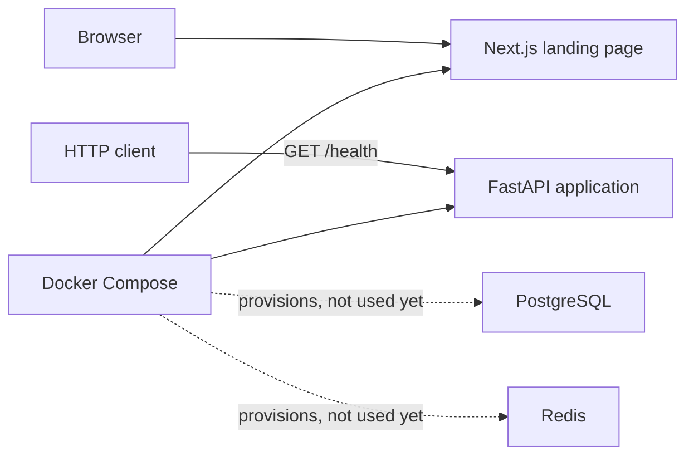
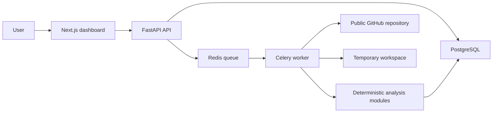

# RepoLens architecture

## Document status

- **Current milestone:** Stage 0 — architecture decisions and project foundation
- **Last updated:** 2026-07-20
- **Architecture style:** monorepo with a modular-monolith backend and a separate web application

This document distinguishes the code that exists in Stage 0 from the target MVP architecture. A component described as planned must not be treated as implemented.

## Architectural goals

RepoLens should remain understandable to a junior developer while creating strong boundaries around untrusted repository content. The architecture is designed to provide:

- deterministic and explainable analysis;
- evidence for every finding and score impact;
- strict separation between repository acquisition, inspection, parsing, rules, scoring, and reporting;
- asynchronous processing for analysis that cannot complete within a normal HTTP request;
- temporary source retention with guaranteed cleanup;
- incremental delivery without premature microservices or shared packages.

## Stage 0 architecture

Stage 0 provides two independent application entry points and local supporting infrastructure:



The Next.js page has a repository URL field and disabled action button. It does not call the API. FastAPI exposes `GET /health` with a typed response and OpenAPI metadata. No repository analysis endpoint, database schema, queue, worker, GitHub client, authentication, or AI integration exists.

### Current repository boundaries

```text
apps/web     Next.js App Router UI, styles, and frontend tests
apps/api     FastAPI application, settings, and backend tests
docs         Requirements, roadmap, architecture, and ADRs
compose.yaml Local web, API, PostgreSQL, and Redis orchestration
```

The applications manage their dependencies independently with pnpm and uv. There is no shared-contracts, shared-config, or analysis-core package in Stage 0 because no implemented code requires one.

## Target MVP architecture (planned)

The MVP will preserve the same deployable web and backend boundaries while adding asynchronous analysis inside the backend codebase:



The API and worker will use modules from the same backend codebase and domain model. The worker is a separate process for operational reasons, not an independently owned microservice.

### Planned component responsibilities

| Component | Responsibility |
| --- | --- |
| URL policy | Accept and canonicalize only supported public `github.com/{owner}/{repository}` URLs. |
| Repository acquisition | Fetch a bounded snapshot into an isolated temporary workspace without executing it. |
| File inventory | Record safe paths, sizes, extensions, exclusions, and a bounded directory tree. |
| Technology detection | Identify languages and important configuration files from deterministic evidence. |
| Documentation inspection | Inspect README, LICENSE, CONTRIBUTING, environment examples, and test documentation. |
| Source parsing | Extract basic Python and TypeScript symbols using bounded, fault-tolerant Tree-sitter parsing. |
| Rule engine | Produce findings whose rule ID, severity, evidence, score impact, and recommendation are explicit. |
| Scoring | Calculate versioned, deterministic category scores and a bounded total score. |
| Reporting | Build one versioned report model used by the API, dashboard, JSON export, and Markdown export. |
| Job orchestration | Own analysis state transitions, idempotency, timeouts, failures, and cleanup. |

The backend may introduce internal modules as these responsibilities become real. The boundaries should be visible in code, but each milestone should add only the structure it uses.

## Planned data flow

The analysis flow is not implemented in Stage 0. Its intended sequence is:

1. The user submits a public GitHub repository URL.
2. The API validates and canonicalizes the URL, then records an analysis request.
3. The API enqueues an idempotent background job and returns an analysis identifier.
4. A worker acquires a shallow repository snapshot in an isolated temporary directory.
5. The worker builds a bounded inventory and skips unsafe, binary, excluded, or oversized content.
6. Detection and parsing modules derive technology, documentation, structure, and symbol facts.
7. Rules convert those facts into evidence-backed findings.
8. The scoring module calculates versioned category and overall scores.
9. The report builder persists derived metadata and export content, not the repository source.
10. Cleanup removes the temporary workspace on success, failure, cancellation, or timeout.
11. The web application polls the API and renders the completed versioned report.

## Data ownership and persistence

There are no application database tables in Stage 0. Planned MVP persistence will store repository identity, analysis lifecycle metadata, findings, scores, and a versioned report. Source files and full repository snapshots will not be stored as product records.

Database migrations will begin when the first real persistence model is introduced. PostgreSQL is the planned system of record; Redis is planned only for queue transport and transient coordination.

## Security invariants

The following rules apply now and to every future milestone:

1. RepoLens never executes code or scripts from an analyzed repository.
2. Repository content is untrusted data; dependency installation, hooks, builds, tests, binaries, and entry points are prohibited.
3. Acquisition must use an allowlisted GitHub URL policy and resist redirects and SSRF.
4. Repository, file-count, file-size, parser-time, and total-analysis limits must be explicit and tested.
5. Symbolic links must not escape the temporary analysis root.
6. Source content is temporary and must be removed in every terminal job state.
7. Logs and persistent records must not contain source bodies, credentials, or tokens.
8. AI may explain verified structured facts but must not invent files, technologies, or findings.

## Development and operational model

- `apps/web` runs as a Next.js development server on port 3000.
- `apps/api` runs as a FastAPI/Uvicorn development server on port 8000.
- Docker Compose also provisions PostgreSQL and Redis with health checks for later stages.
- Source mounts and reload commands support local iteration; Stage 0 does not contain production deployment optimization.
- GitHub Actions independently verifies backend formatting, linting, typing, and tests, plus frontend linting, typing, tests, and production build.

Commands and local prerequisites are documented in the repository README. Architecture changes that alter component ownership, deployment boundaries, data retention, or safety guarantees require an ADR.

## Evolution constraints

Split a backend capability into a separate service only when measured scaling, reliability, release cadence, or ownership needs justify the operational cost. Introduce a shared package only after implemented consumers require a stable shared contract. Until then, favor explicit modules and ordinary function calls within the backend codebase.
