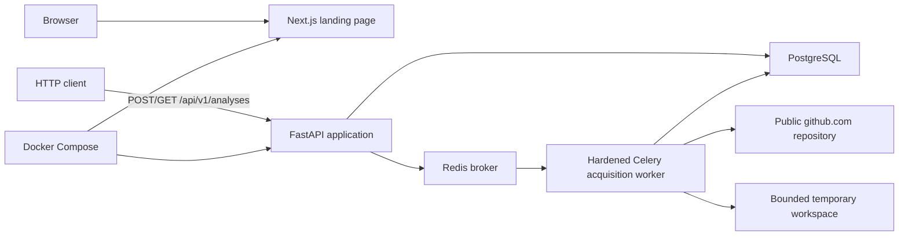
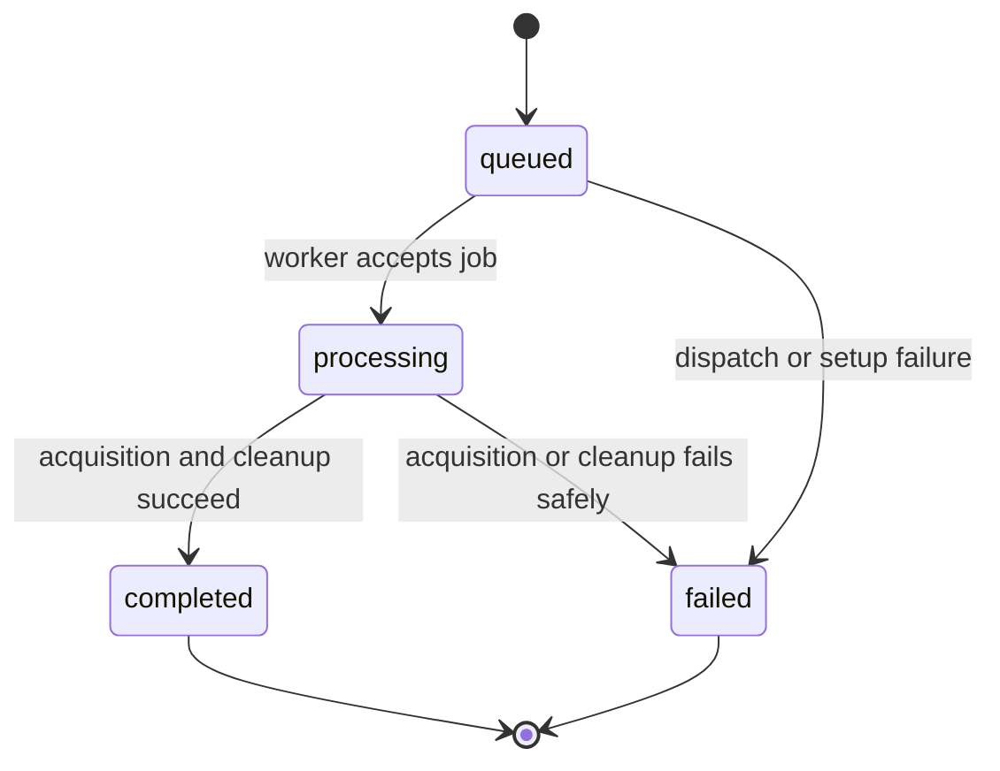
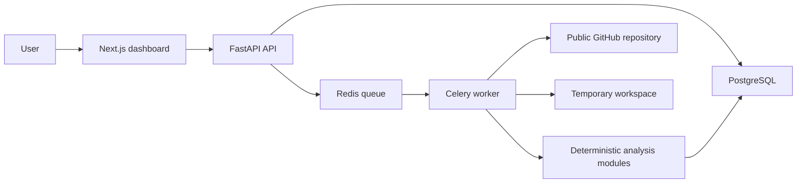

# RepoLens architecture

## Document status

- **Current milestone:** Stage 2 — safe repository acquisition and worker hardening
- **Last updated:** 2026-07-22
- **Architecture style:** monorepo with a modular-monolith backend and a separate web application

This document distinguishes the code that exists through Stage 2 from the target MVP architecture. A component described as planned must not be treated as implemented.

## Architectural goals

RepoLens should remain understandable to a junior developer while creating strong boundaries around untrusted repository content. The architecture is designed to provide:

- deterministic and explainable analysis;
- evidence for every finding and score impact;
- strict separation between repository acquisition, inspection, parsing, rules, scoring, and reporting;
- asynchronous processing for analysis that cannot complete within a normal HTTP request;
- temporary source retention with guaranteed cleanup;
- incremental delivery without premature microservices or shared packages.

## Current Stage 2 architecture

Stage 2 keeps the web application independent while adding bounded repository acquisition to the persisted API workflow and background worker:



The Next.js page still has a repository URL field and disabled action button; it does not call the API. FastAPI exposes `GET /health`, `POST /api/v1/analyses`, and `GET /api/v1/analyses/{analysis_id}`. The API accepts only canonicalizable public HTTPS GitHub repository URLs, stores repository identities and analysis lifecycle records, and publishes acquisition work to Redis. The worker shallow-clones only the stored canonical URL, enforces process and filesystem limits, removes the temporary source, and persists valid lifecycle transitions.

Alembic owns the PostgreSQL schema. SQLAlchemy's asynchronous engine and sessions are shared by the API and worker. Redis is transport only and is not a system of record.

### Current repository boundaries

```text
apps/web     Next.js App Router UI, styles, and frontend tests
apps/api     FastAPI API, persistence, migrations, acquisition worker, and tests
docs         Requirements, roadmap, architecture, and ADRs
compose.yaml Local web, API, worker, PostgreSQL, and Redis orchestration
```

The applications manage their dependencies independently with pnpm and uv. There is no shared-contracts, shared-config, or analysis-core package because no implemented consumers require one.

### Implemented analysis lifecycle



Terminal jobs are idempotent when redelivered. The transition policy blocks all other state changes. Safe, generic failure messages are persisted and returned; internal exception details are not exposed through the API.

## Target MVP architecture (planned)

The MVP will preserve the same deployable web and backend boundaries while adding asynchronous analysis inside the backend codebase:



The API and worker will use modules from the same backend codebase and domain model. The worker is a separate process for operational reasons, not an independently owned microservice.

### Planned component responsibilities

| Component | Responsibility |
| --- | --- |
| URL policy | Accept and canonicalize only supported public `github.com/{owner}/{repository}` URLs. |
| Repository acquisition | Fetch a bounded snapshot into an isolated temporary workspace without executing it. |
| File inventory | Record safe paths, sizes, extensions, exclusions, and a bounded directory tree. |
| Technology detection | Identify languages and important configuration files from deterministic evidence. |
| Documentation inspection | Inspect README, LICENSE, CONTRIBUTING, environment examples, and test documentation. |
| Source parsing | Extract basic Python and TypeScript symbols using bounded, fault-tolerant Tree-sitter parsing. |
| Rule engine | Produce findings whose rule ID, severity, evidence, score impact, and recommendation are explicit. |
| Scoring | Calculate versioned, deterministic category scores and a bounded total score. |
| Reporting | Build one versioned report model used by the API, dashboard, JSON export, and Markdown export. |
| Job orchestration | Own analysis state transitions, idempotency, timeouts, failures, and cleanup. |

The backend may introduce internal modules as these responsibilities become real. The boundaries should be visible in code, but each milestone should add only the structure it uses.

## Data flow

Stages 1 and 2 implement steps 1-7. Steps 8-13 remain planned:

1. The user submits a public GitHub repository URL.
2. The API validates and canonicalizes the URL, then records an analysis request.
3. The API enqueues an idempotent background job and returns an analysis identifier.
4. The Celery worker atomically claims the analysis using its delivery identifier, reloads the canonical URL from PostgreSQL, and acquires a shallow repository snapshot in an isolated temporary directory.
5. Acquisition disables repository hooks, prompts, credential helpers, submodules, LFS smudging, unsafe protocols, and redirects; time and workspace growth are bounded throughout the Git process.
6. A security-only filesystem pass rejects limit violations, symbolic links, unsafe paths, and special files without producing or storing an inventory.
7. Git metadata and the complete workspace are removed before the analysis is marked complete.
8. A future worker stage will build a bounded inventory and skip unsafe, binary, excluded, or oversized content.
9. Future detection and parsing modules derive technology, documentation, structure, and symbol facts.
10. Rules convert those facts into evidence-backed findings.
11. The scoring module calculates versioned category and overall scores.
12. The report builder persists derived metadata and export content, not repository source.
13. The web application polls the API and renders the completed versioned report.

## Data ownership and persistence

Stage 2 stores canonical repository identity, analysis lifecycle metadata, a safe acquisition error code, and an internal processing-delivery token in `repositories` and `analyses`. Planned MVP persistence will later add findings, scores, and a versioned report. Source files, file inventories, workspace paths, Git output, and repository snapshots are not stored as product records.

Alembic migrations version the PostgreSQL schema. PostgreSQL is the system of record; Redis is used only for queue transport and transient coordination.

## Security invariants

The following rules apply now and to every future milestone:

1. RepoLens never executes code or scripts from an analyzed repository.
2. Repository content is untrusted data; dependency installation, hooks, builds, tests, binaries, and entry points are prohibited.
3. Acquisition must use an allowlisted GitHub URL policy and resist redirects and SSRF.
4. Repository, file-count, file-size, parser-time, and total-analysis limits must be explicit and tested.
5. Symbolic links must not escape the temporary analysis root.
6. Source content is temporary and must be removed in every terminal job state.
7. Logs and persistent records must not contain source bodies, credentials, or tokens.
8. AI may explain verified structured facts but must not invent files, technologies, or findings.

## Development and operational model

- `apps/web` runs as a Next.js development server on port 3000.
- `apps/api` runs as a FastAPI/Uvicorn development server on port 8000.
- Docker Compose runs PostgreSQL and Redis with health checks and starts the API and worker only after both dependencies are healthy.
- The worker runs as UID/GID 65534 with a read-only root filesystem, no Linux capabilities, no-new-privileges, explicit memory/CPU/PID limits, and bounded noexec tmpfs mounts for runtime and repository data.
- The API and worker reach PostgreSQL and Redis over separate internal networks. Only the worker joins its egress network; Docker Compose does not enforce a domain-based GitHub allowlist.
- PostgreSQL and Redis development ports bind only to host loopback. The worker source bind mount is limited to read-only application source.
- GitHub Actions independently verifies backend formatting, linting, typing, and tests, plus frontend linting, typing, tests, and production build.

Commands and local prerequisites are documented in the repository README. Architecture changes that alter component ownership, deployment boundaries, data retention, or safety guarantees require an ADR.

## Evolution constraints

Split a backend capability into a separate service only when measured scaling, reliability, release cadence, or ownership needs justify the operational cost. Introduce a shared package only after implemented consumers require a stable shared contract. Until then, favor explicit modules and ordinary function calls within the backend codebase.
